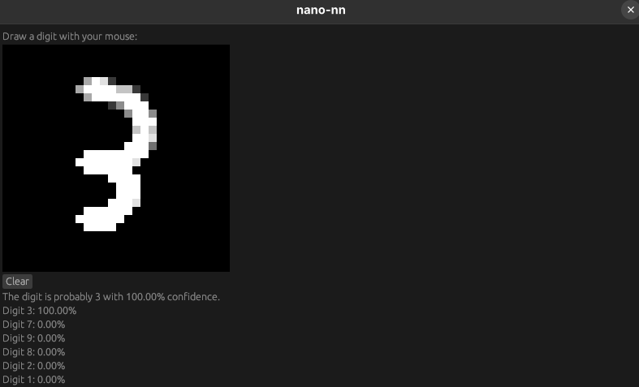

# nano-NN.rs

A simple neural network written in Rust that can recognize handwritten digits using the MNIST dataset. It supports both command-line and GUI-based inference.

This project is inspired by [nano-NN](https://github.com/babidisrc/nano-NN) by [Babi](https://github.com/babidisrc), originally written in C.

The MNIST dataset is a collection of 70,000 handwritten digits (0-9), split into 60,000 training images and 10,000 test images. Each image is a 28x28 grayscale image, making it a popular dataset for benchmarking machine learning models



# Build from Source

1. Clone the repository:

```bash
git clone https://github.com/erickcestari/nano-NN.rs.git
cd nano-NN.rs
```

2. Build the executable:

```bash
cargo build --release
```

# Usage

Train a neural network model (the model will be saved to `model.json` in the current directory) and make predictions on a test image or draw the digit in the GUI mode:

```bash
./target/release/nano-nn --image path/to/image.png

# or with the GUI mode (Draw a Digit)
./target/release/nano-nn --gui
```

## Import Existing Model

Import a pre-trained neural network model and make predictions on a test image or use the GUI mode:

```bash
./target/release/nano-nn --model path/to/model.json --image path/to/image.png

# or with the GUI mode (Draw a Digit)
./target/release/nano-nn --gui --model path/to/model.json
```
## Examples

Example command:

```bash
./nano-nn --image ./sample.png --model ./example-model.json 
```

Example output:

```bash
Loading image: ./sample.png
Loading model: ./example-model.json

Making prediction on input image...

Prediction results:
------------------------------
Digit 0: 100.00%
Digit 5: 0.00%
Digit 2: 0.00%
------------------------------

The digit is probably 0 with 100.00% confidence.
```

Example command with GUI mode:

```bash
./nano-nn --gui --model ./example-model.json
```

Example output:

